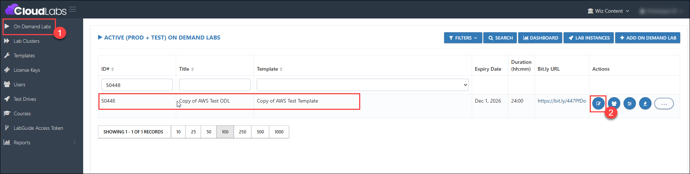
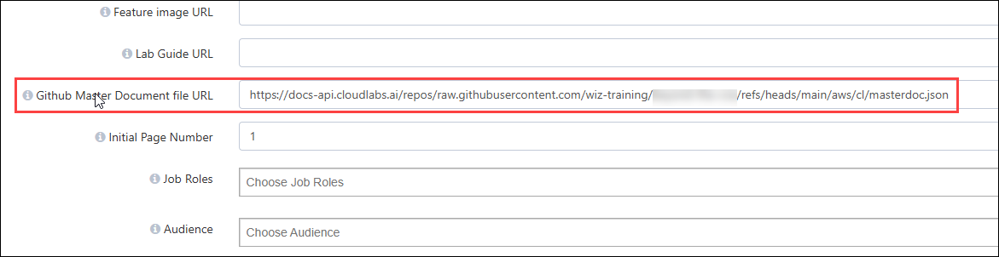
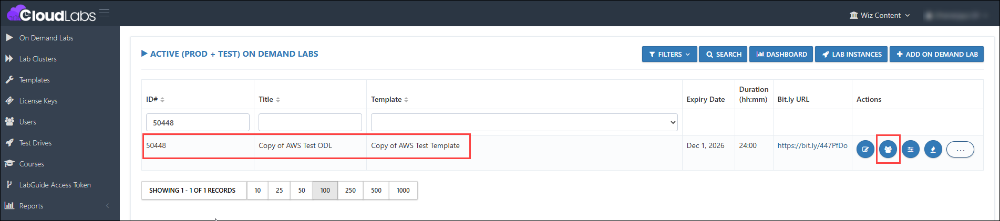
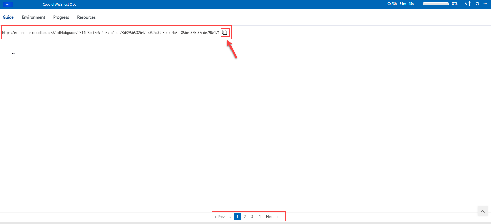
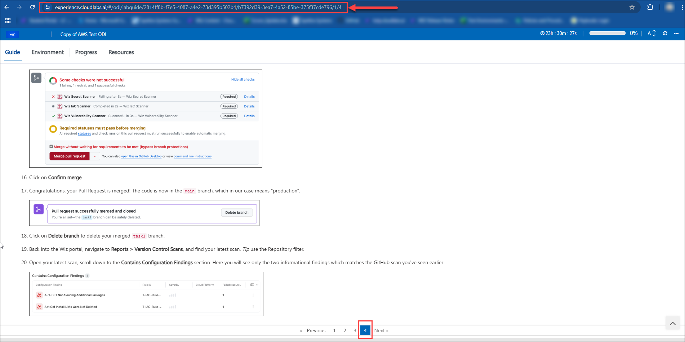

## 45. Inject Key for the Lab Guide URL

### Feature Requirement

Inject Key for the Lab Guide URL

### Implementation

Users can navigate directly to any numbered page in the Lab Guide by using the inject key URL and appending a forward slash (/) followed by the page number.

### Inject Key for the Lab Guide URL

1. Use the below Inject Key in the Lab Guide.

   ``
   <inject value="https://experience.cloudlabs.ai/#/odl/labguide/" key="ODLUniqueName" value="/" key="AttendeeUniqueName" value="/1/1" enableCopy="true" />
   ``

   >**Note:** **ODLUniqueName** represents the unique ODL ID in the Lab Guide of the deployed user.

   >**Note:** **AttendeeUniqueName** represents the attendee’s (user’s) unique ID in the Lab Guide of the deployed user.

2. Log in to the CL portal and navigate to the required tenant (WIZ). On the left-hand side of the page, you will see the ODL section.

3. Navigate to the **ODL (1)** section in the left menu and open your respective ODL. Click the **Edit (2)** button. 

   

4. Provide the **GitHub Master Document file URL** in the ODL.

   

5. Click the **Submit** button. 

   

6. Navigate to the **Users** section and deploy the user. 

   

7. Once the user is deployed, you will see the **Inject Key** present on the Lab Guide. Copy the URL, open a new tab, and paste it into the new tab. At the end of the URL, replace the page number with the one you want to navigate to in the Lab Guide, and then press Enter. The specified page will be displayed.

   

   

